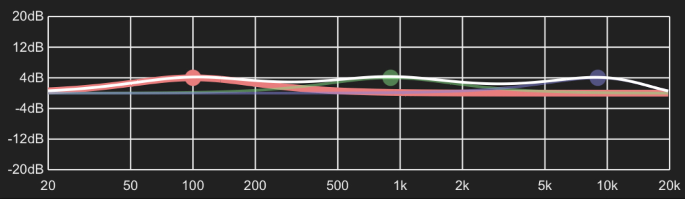

# Tone Controls

Tone controls provide simple frequency adjustments, which allows the boosting or reducing of the bass and treble regions of the music sent to the player.

## Usage

There are three controls available, Bass, Mid and Treble. These correspond to a range of frequencies centred on 100Hz, 900Hz and 9000Hz. Boosting or cutting the volume of the audio signal around these centres is accomplished by adjusting the three sliders.

## Technical Details

The tone controls apply a basic three frequency [Parametric Equaliser](parametriceq.md) filter to the audio signal utilising the Peak (aka Bell) filter type. The following image shows the resultant effect of setting all three controls to +4.0dB

