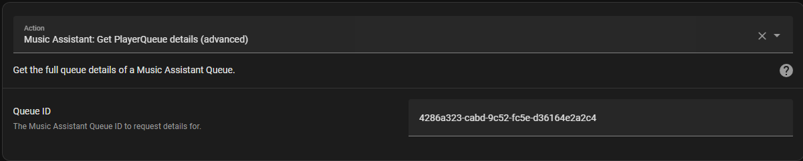

# MA get_queue Action

This action allows you to retrieve the details of a queue



The returned JSON is extensive and includes information about the current and next item in the queue. The [returned data can be used in templates](https://www.home-assistant.io/docs/scripts/perform-actions#use-templates-to-handle-response-data).

## Example

```
script:
  get_now_playing:
    mode: queued
    alias: "Get Now Playing Track Name"
    sequence:
      - action: music_assistant.get_queue
        data:
          entity_id: media_player.ma_kitchen_speaker
        response_variable: queue_info
      - service: input_text.set_value
        data:
          entity_id: input_text.now_playing
          value: '{{ queue_info['media_player.ma_kitchen_speaker'].current_item.name[:50] }}'
```
