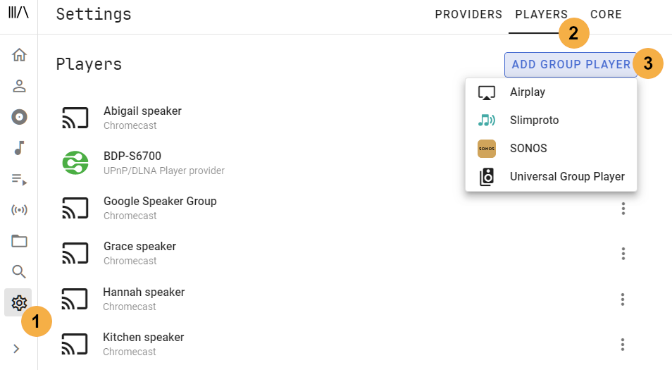
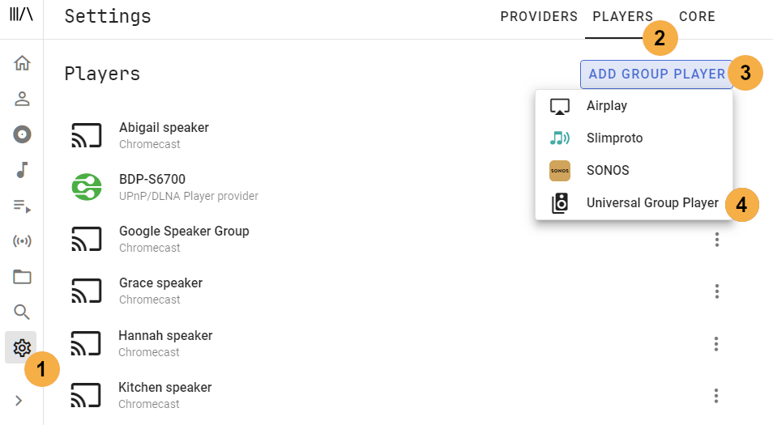

# Groups

!!! warning "Note"
    Do not delete or disable a player which is in a group while the group is playing
    
## Manual Sync

These are temporary group players that are configured via the [Player List](ui.md#player-list).

### Features

- Players can dynamically be added or removed before or during playback
- The HA action [media_player.join](https://www.home-assistant.io/integrations/media_player/#action-media_playerjoin) can be used to create this type of group

### Known Issues / Notes

- Players can be linked via the chain icon in the [Player List](../ui.md#player-list)
- Only like player types that support synced playback are allowed to be joined. These players will then play in sync
- When players are grouped in this way only the main player holds the queue. For example, player A has an existing queue and players B and C are joined to player A. If player A is turned off players B and C will stop
- Some player types may pause momentarily as a new device is joined 

## Sync Groups

These are permanent group players that are configured via the MA settings. These should be used when the make up of the group will rarely change.

### Features

- The native player types shown (i.e. not the Universal Group option) support perfect sync (this is a requirement to be shown in the list)
- In addition to playing in sync the group will hold the queue regardless of which player(s) in the group are powered off
  
### Known Issues / Notes

- As mentioned above the group player holds the queue rather than any individual player, however, if the group leader is lost then playback will stop but the queue can be restarted
- The group will not power on if one of the child players is synced to another group

## Universal Groups

Music Assistant has support for grouping dissimilar playback devices. 

### Features

All devices (except Chromecast) can be grouped but not all will play in sync. See the individual players for their limitations.

!!! tip
    Reminder Chromecast devices must be grouped in the Google Home app for perfect sync

### Known Issues / Notes

- This type of group should be avoided if a [Sync Group or Native Group](../ui.md#grouping-players) can be used
- Universal Groups can include sync groups but not other universal groups
- Universal Groups are on a best-effort basis and might not work correctly with all player models or give unexpected results
