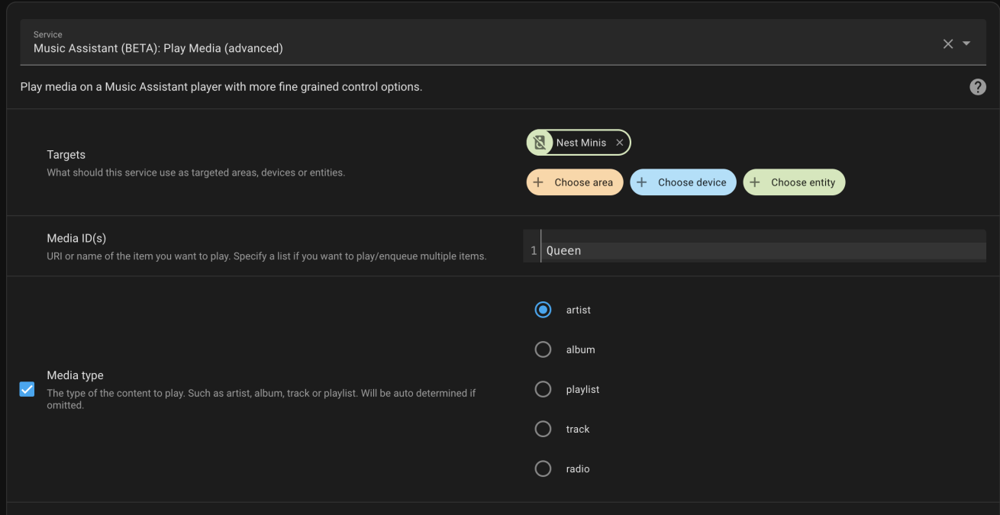
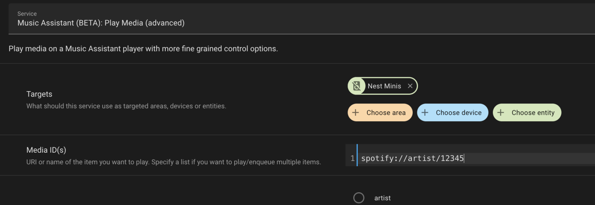
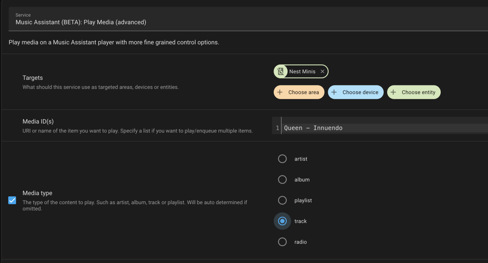
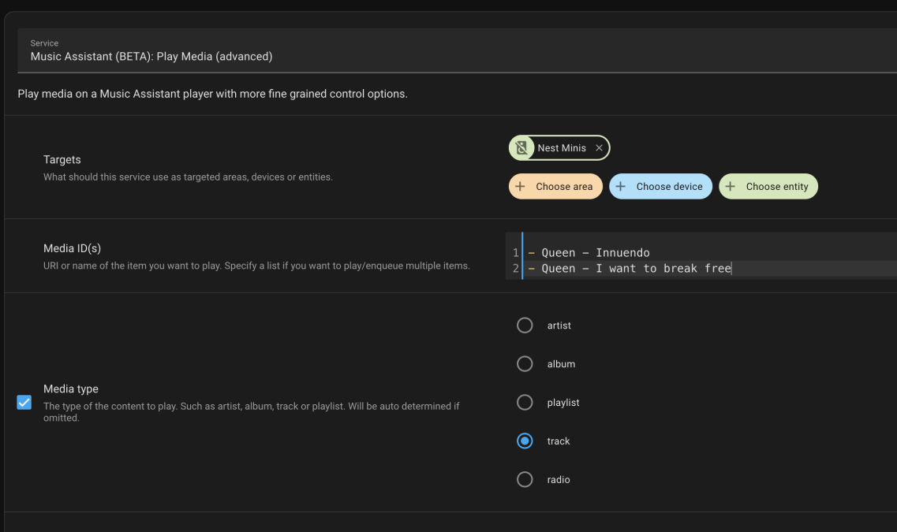

# MA play_media Action

This action allows you to finely select the media to play. Create your service call or automation via the HA GUI or YAML

You can use a name together with the media type

Or just a URI

Or the library id together with the media id

Or a track defined with the artist name, media type is recommended but optional

You can also have a list of items

Or a list of uris which can even be from different music providers

!!! note
    The regular `media_player.play_media` service call also accepts all of the above but it cannot take multiple items

There are additional options as well. Enqueue will appear when an entity that supports it is selected.

!!! warning "Radio Mode Media Type"
    You can only use the album, artist or track media_type if enabling Radio Mode
