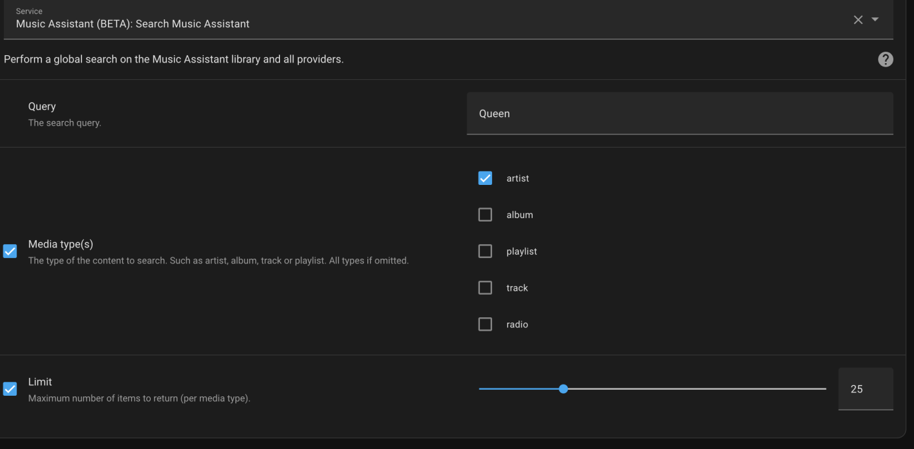
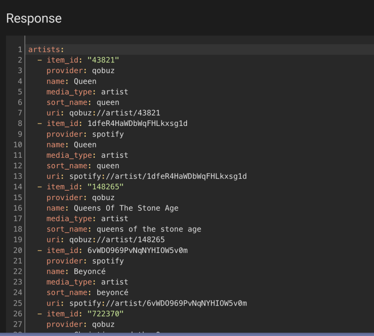

# MA search Action

This action does a global search across all providers 



This will return something like this



You could then use a template to extract what you need and then use the `play_media` service call. For example:

```
script:
  search_ma:
    mode: queued
    alias: "Jukebox MA search"
    sequence:
      - action: mass.search
        data:
          limit: 8
          name: "{{ states.input_text.jukebox_search.state}}"
        response_variable: results
      - action: input_text.set_value
        data:
          entity_id: input_text.jukebox_track_1
          value: '{{ results.tracks[0].name }}'
      - action: input_text.set_value
        data:
          entity_id: input_text.jukebox_artist_1
          value: '{{ results.tracks[0].artists[0].name }}'
```

