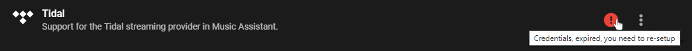

# First things to try and how to report issues

Look in the logs and try and resolve any errors you see there particularly those related to [tagging](https://music-assistant.io/music-providers/filesystem/#tagging-files). Connection errors are symptomatic of networking problems or container misconfiguration.

Probably the most common issue is people trying to run MA with complicated network setups. Running behind VPNs, across subnets or VLANs, behind firewalls, local SSL, using reverse proxies or inside containers is not supported (it might work but we can’t troubleshoot for you as MA is run by a small team who don't have the resources to help with non-MA issues). Search Discord for these problems as users have regularly reported these issues and found that it is their setup that was causing the fault; their solution might help you.

For clarity, running installation options other than HAOS or simple docker and/or more complex network setups is at your own risk and we do not have the capacity to provide direct support (e.g Kubernetes is not supported).

There are settings available in MA SETTINGS>>CORE>>STREAMSERVER>>CONFIGURE>>ADVANCED that might help you if you have non-standard setups. If you are running MA in your own docker container then make sure you have the correct PUBLISHED IP ADDRESS and BIND TO IP/INTERFACE set. Ensure containers are in HOST networking mode and note the extra privileges in the [example docker command](../installation.md#docker-image).

Most players are discovered using mDNS (broadcast) so if your players do not get discovered it means that your network is blocking that traffic (e.g. IGMP or multicast snooping or filtering). You will have to check your settings (e.g. WiFi setup) if multicast is being blocked. Business solutions tend to block multicast traffic as much as possible as it hurts performance when there are many clients. In a home setup is it mandatory to have because all home gear relies on multicast.

Make sure the HA internal url is set correctly. HA SETTINGS>>SYSTEM>>NETWORK>>Home Assistant URL>>Local network (set to automatic or use your internal HA IP). If it is automatic you can try changing it to http://your.internal.ip:8123/

MA streams at high quality which may max out poor network connections. If possible use wired connections for MA players. Input codec is not always the same as the output codec (which is FLAC) so playing a low qualiy MP3 will not change the apparent performance. If you experience stuttering or other interrupted playback issues which are not apparent on wired players or those close to your access points then poor WiFi is likely to blame. You will need to improve your WiFi coverage.

Check the physical device settings. There have been numerous reports where the issue was actually a setting external to MA such as receivers set to repeat tracks or ESP devices with incorrect arguments passed on install.

Ensure local files are [tagged properly](https://music-assistant.io/music-providers/filesystem/#tagging-files).

If it is a playback issue then turn on QUEUE FLOW MODE in the settings for the specific player (where that is available).

If it is a frontend issue or related to logging in to a provider which requires redirection to another website then try a different browser. If you are trying on a mobile device then try on a laptop or PC. Firefox and Safari are known to have deficiencies.

Review the applicable player or music provider documentation to see if there are known issues or specific troubleshooting steps or fixes. 

For voice problems refer to [Voice Troubleshooting](https://music-assistant.io/integration/voice/#troubleshooting). If you are not using HOME ASSISTANT as your Conversation Agent then you must seek assistance in the HA forums first. If they direct you back to this project then make it clear in your report that you are using a LLM as the Conversation Agent and include the reasons why the HA support network wasn't able to help.

Try power cycling the physical player(s) if they won't connect or if there is no sound.

If after an update something isn't working then trying clearing the cache MA SETTINGS>>CORE>>CACHE CONTROLLER>>CONFIGURE>>CLEAR CACHE. If that doesn't fix it then check the GitHub Issues and Discord to see if it is a known problem. If not try restarting MA, try restarting HA, and try a full HOST REBOOT (in that order). If it is an integration problem then trying removing it from HA settings and HACS then restart HA then reinstall.

Before you raise an issue [read this first](../support.md). Report issues using the template with as much detail as possible. Often posts aren’t clear about exactly what is typed where, how something is configured or what series of menus are selected. Screenshots can be helpful. DOWNLOAD and ATTACH complete logs from MA settings>>CORE. You can also look in the Browser console when you have front end issues which in Chrome browser is --> F12 for developer tools --> console. Please include the following in ALL reports:

- What music provider is in use when the problem is observed? What other music providers have you tried (if you have no others then make that clear)
- What player provider is in use when the problem is observed? What other player providers have you tried (if you have no others then make that clear)
- Are the players grouped?
- How is playback being instigated (e.g. automation or via the UI)
- If you aren't using HAOS then exactly how you have installed MA
- What is working (e.g. player works with music provider X but not Y)
- What you have tried from this page that hasn't helped

!!! note
    You can retrieve the full MA logs by going to the MA settings and clicking on CORE

# A provider isn't working

Navigate to MA settings and inspect the provider entry. If there is a red circle with an exclamation mark next to it then hover over that icon to see the error message.

# Why aren't tracks/albums matching between providers

Matching items between streaming providers is challenging as they do not all provide the same or unique metadata to definitively identify a match. If you think there is an obvious match (eg. same artist and track and album) then please submit an issue report. For more information about how MA uses metadata in various ways see here https://github.com/music-assistant/hass-music-assistant/discussions/543

# My media player is not available or not playing

Review the list of player providers. If your device doesn't support one of the listed protocols then it won't currently work. Review the [GitHub Discussions](https://github.com/orgs/music-assistant/discussions) to see if others have requested support and join in the conversation.

If your device does support one of the supported protocols then review the documentation for that player provider for known issues and troubleshooting tips.

If your device still doesn't work and you think it should then review the full logs for discovery information and errors. Review the first things to try at the top of this page as usually if you get this far without identiying why the player isnt working it will be a networking or non-standard installation issue which, generally, you will need to resolve yourself. Search the Github [Issues](https://github.com/music-assistant/support/issues), [Discussions](https://github.com/orgs/music-assistant/discussions) and [Discord](https://discord.gg/kaVm8hGpne)) as likely someone has asked your question before.

# All my media is missing 

Ensure the favourites filter is OFF. At the top of each view is a ❤️. Ensure it is hollow.

If you are trying to view playlists through the HA media view then you should note that only favourited playlists will show up and additionally you need to have a MA player selected to see the MA Library. HA's media browser doesn't have any filter or sorting options like MA's frontend has.

# I don't see any tracks or albums for an Artist on a streaming provider

See the [Usage and Music Provider notes](../usage.md)

# My local album art isn’t being picked up

Art embedded in music tracks will always be picked up but folder.jpg images will only be imported if the folder name **exactly** matches the album (except for any characters that are prohibited in folder names. E.g. / )

# There isn't any metadata for my music

For local files, you can either fully tag your music (this is preferred and it is recommended to use [Picard](https://picard.musicbrainz.org/)) or have an artist folder with the artist.nfo in there (just like the images) and that will be preferred. Online metadata providers are only queried when there is no local data. https://kodi.wiki/view/NFO_files

# I have updated but MA looks like the old version or isn’t working

Possibly your browser is using a cached version of the front end. Try forcing a refresh Chrome, Firefox, or Edge for Windows: Press Ctrl+F5 (If that doesn’t work, try Shift+F5 or Ctrl+Shift+R).

if the above doesn’t work look [here for some more options](https://www.webinstinct.com/faq/how-to-disable-browser-cache)

For the IOS app see [here](https://community.home-assistant.io/t/anyone-know-how-to-clear-cache-in-the-ios-app/64569/10)

# The second zone of my amplifier is not seen by MA or MA won't turn on my amplifier

MA is an INPUT to your amplifier. So you need to power on your amplifier and then select the INPUT that MA is streaming to (e.g. Airplay, DLNA, Chromecast). For this reason MA does not see the amplifier zones it only sees the compatible inputs of the amplifier. 

Some amplifiers may auto turn on when a signal is detected so check the amplifier options. If this functionality is not available then you will need to power on the amplifier via another means. The power icons that are seen beside the players must be seen as starting and stopping the stream to the player not as physically powering on or off the device.

# My local music isn’t being imported or I’m seeing missing ID3 tag warnings in the logs

This is likely a tagging problem. See [here](../music-providers/filesystem.md/#tagging-files)

# MA is interfering with my Spotify Connect or Other Streaming App

If the MA player is "powered on" from the MA UI then MA understands that it is allowed to take control of the player. This may then happen even though you have started playback via another app but have not started playback via MA. To avoid this situation "power off" the MA player.

# MA is crashing on start

Start MA in safe mode
- With the addon select the toggle in the configration
- With Docker run the container with the environmental variable MASS_SAFE_MODE set to a boolean true value, e.g. "1" or "true"

If MA now starts, you can start any of the providers by clicking "reload" in the settings (click the 3 dots). If one particular provider causes MA to crash then open an issue with the details

