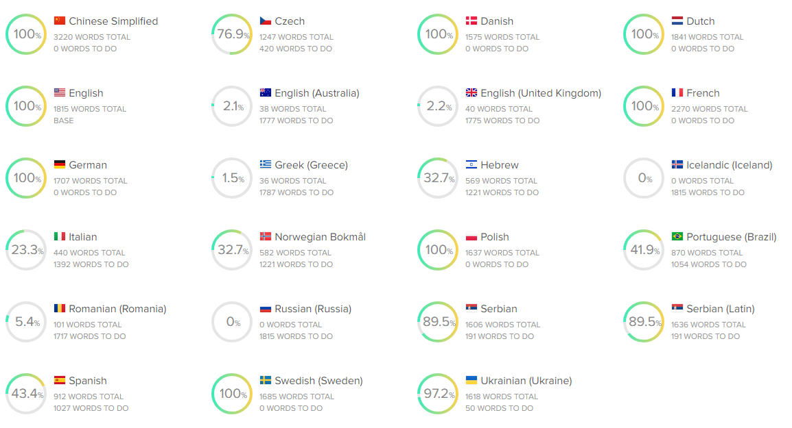

If you're following the frontend repo, you may have seen that we are now using Lokalise as a central translation management portal.

At the time of writing MA is available in Czech, Danish 🇩🇰, Dutch 🇳🇱, English 🇬🇧, French 🇫🇷, German 🇩🇪, Hebrew 🇮🇱, Italian 🇮🇹, Norwegian 🇳🇴, Polish 🇵🇱, Portuguese 🇵🇹, Russian, Serbian, Spanish 🇪🇸 and Ukranian 🇺🇦.

We would love to support more languages, and we need your help to do so.

## How can I contribute?

- Create an issue in the [issue tracker](https://github.com/music-assistant/hass-music-assistant/issues) stating the Language that want you to contribute.

- We will then add this language to the project in Lokalise, and resolve the issue in GitHub

- Once the issue is resolved, you'll be able to use this [sign-up link](https://app.lokalise.com/public/321419046440c0f2bba414.05634832/) to join the project as a translator.

Please only select the language that you intend to contribute to when requesting to join the team on Lokalise.

Thanks for taking the time to read this, we're looking forward to your contributions.

## Onboarding

The Lokalise team have prepared extensive documentation to get started and comfortable with the platform [here](https://docs.lokalise.com/en/articles/2967175-onboarding-guide-for-translators)

If you prefer to jump straight into a video tutorial, you can watch that below.

