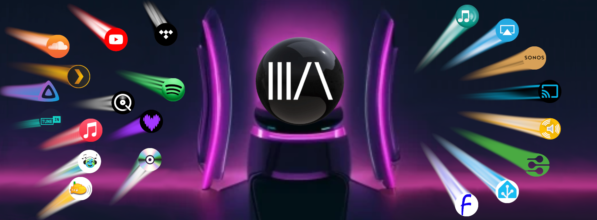
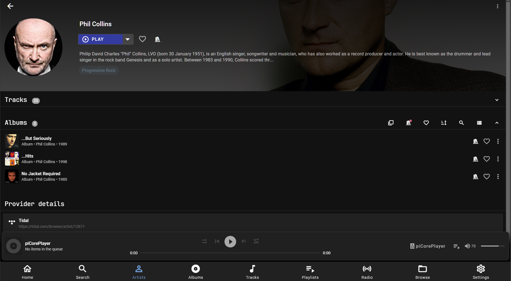
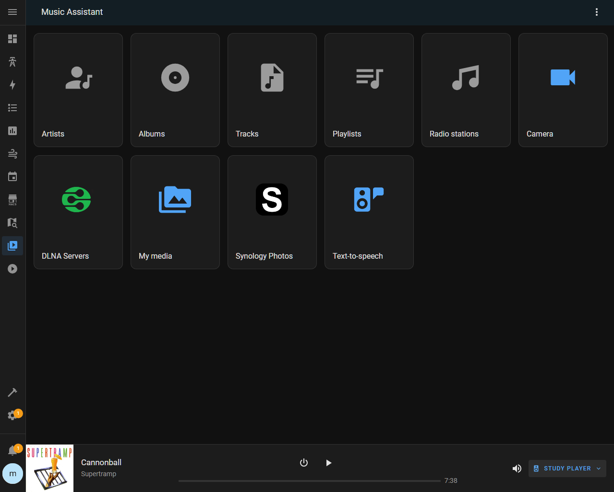
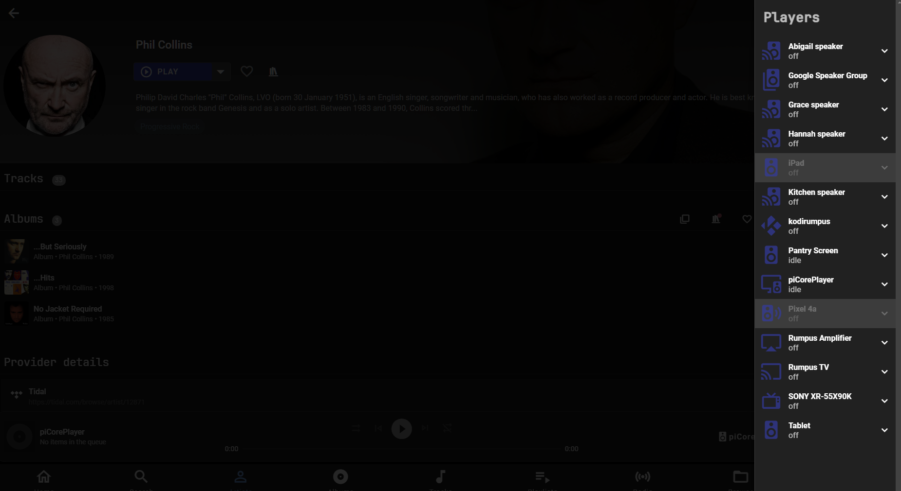

# Music Assistant

Turn your Home Assistant instance into a jukebox and enjoy hassle free streaming of your favourite media to Home Assistant media players.

Music Assistant is a music library manager for your offline and online music sources which can be combined with the power of Home Assistant to easily stream your favourite music to a wide range of supported players.

## Features

- Supports multiple music sources through a provider implementation.
- Many popular streaming services are supported, as well as local files.
- Automatically matches music on different providers (track linking).
- Fetches metadata for extended artist information.
- Keeps track of the entire music library in a compact database
- Gapless, crossfade and volume normalization support for all players.
- Playback synchronisation is possibie for supported players
- Truly hassle free streaming of your favourite music to players, no advanced knowledge required.
- Rich User interface (Progressive Web App) powered by VueJS 3.

## Architecture

Music Assistant consists of multiple building blocks:

- Music Assistant Server
- Music Assistant integration for Home Assistant

## Music Assistant Server

The Music Assistant server is a free, opensource Media library manager that connects to your streaming services and a wide range of connected speakers. The server is the beating heart, the core of Music Assistant and it keeps track of your music sources. It must run on an always-on device like a Raspberry Pi, a NAS or an Intel NUC or alike. The server can access multiple music providers and stream to multiple player types.

## Music Assistant Integration

Connects Home Assistant to your Music Assistant Server to allow control from your HA imstance, allow you to automate your music and allow voice control!

## Preview

 {width = 800 } 

Click to show more screenshots

 {width = 800 } 

 {width = 800 } 

## Documentation and support

- [issue tracker](https://github.com/music-assistant/hass-music-assistant/issues) to create bug reports, please include detailed info and logfiles. Please check if your issue has already been reported.
- [feature requests](https://github.com/music-assistant/hass-music-assistant/discussions/categories/feature-requests-and-ideas): Give your vote to an existing request, join the discussion or add a new request.
- [Q&A section](https://github.com/music-assistant/hass-music-assistant/discussions/categories/q-a-faq) Frequently asked questions and tutorials
- [discord community](https://discord.gg/kaVm8hGpne) Join the community and get support!

## I want to help

With a large project like this, there is always enough todo. Not only with actual writing of code but also in documentation, providing support, testing etc. Ofcourse you help me out greatly by donating me a few bucks but helping out can also be done in other ways:

- If you like to help with the development, e.g. implementing a new music provider or fix a player specific quirk, please reach out to me on discord in a PM. I did not have time to write extended development docs but once you get the grasp of the structure it is relatively straight forward.
- Help others out on discord or within the discussions part of Github.
- Help out with writing documentation and HOWTO's and the FAQ's.
- Just like [erkr](https://github.com/erkr) and [OzGav](https://github.com/OzGav) help out as a moderator on discord and Github with the load of incoming reports, request and questions. Thanks guys!
- Make sure to like this project by clicking the "star" button and share it with others!

## Donations

As explained above you can also show your appreciation in all kinds of ways. Besides that donations are great for me as a small fee back for all the free time I invest in this project. For buying some test hardware and streaming provider accounts and contributions to the metadata projects.

- [Github Sponsors](https://github.com/music-assistant)
- [Buy me a Coffee](https://www.buymeacoffee.com/marcelveldt)

A really big thank you in advance from me and my family!

___________________________________________

I hope you like my little pet project I've been working on for the last 3 years.
I'm sure that together with the really great HA community we can grow this project into something really great. Thanks!

Kind regards,

Marcel

[repository-badge]: https://img.shields.io/badge/Add%20repository%20to%20my-Home%20Assistant-41BDF5?logo=home-assistant&style=for-the-badge
[repository-url]: https://my.home-assistant.io/redirect/supervisor_add_addon_repository/?repository_url=https%3A%2F%2Fgithub.com%2Fmusic-assistant%2Fhome-assistant-addon
