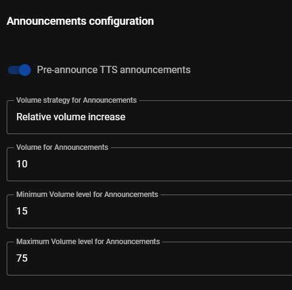

# Announcements

Announcements are either Text-to-Speech or audio files that are sent (from Home Assistant) to the MA players via the [`tts.xxxxxx`](https://www.home-assistant.io/integrations/tts/) or [`music_assistant.play_announcement`](../faq/massannounce.md) HA actions. 

## Overview

If music is playing this will be temporarily paused and restored after the announcement.

Players will be powered on before the announcement and then off again if it was not powered/active before the announcement.

Volume can be adjusted while playing the announcement.

If a player type has native support for announcements (e.g. Sonos) then that will be used in preference to the MA functionality providing an even smoother experience.

The functionality works with all players that are supported by Music Assistant.

Each player has settings which allow for adjustment of certain aspects of the announcement playback. Groups only have a setting for the pre-announcement sound.

## Native Support

If an announcement is sent to a single player that supports native announcements, the announcement will be handled by the player itself.

Native announcement support usually means that the player can "overlay" the announcement on top of any music that is playing. It will "duck" the volume of the music, play the announcement with a volume boost and then revert the music volume. Music keeps playing and the entire announcement will be handled by the player itself.

Currently the only (known) player type that supports native announcements is Sonos S2 speakers.  Hopefully more player types will follow.

## MA Player Support

If a player does not support native announcements, MA will take care of it by stopping any playing music, adjust the volume (as configured), play the announcement, and then restore the previous state.

!!! note
    The MA announcement feature will ONLY work reliably if the player reports the state (e.g. playing, paused, idle) and the progress report (elapsed time) correctly. If any of those are not updated correctly then announcements will work poorly.

ESPHome and Snapcast can be unreliable with state updates so issues may occur with those player types. The same applies to some HA media players. Future updates of those platforms should improve performance.

If a player does not resume after playing an announcement, or it takes a very long time, check the HTTP profile settings. `Fixed content length` may need to be used. For example, (the current) ESPHome devices have this issue.

## Group Behaviour

If an announcement is sent to a native Google Cast Group, Sync Group or a Universal Group, the announcement will always be played to ALL child players. The preference to (not) use a pre-announcement sound is defined on the group player in this case. The volume setting of the announcement is defined per player. If one of the child players was already playing, playback will be interrupted and NOT resumed. Bear that in mind with automations and target announcements to the individual players or just restart individual player playback if/when needed. Google Cast groups should play the announcement in sync.

If an announcement is sent to a group of players that are manually synced, the announcement will be played to all childplayers (in sync).

If an announcement is sent to a Sync Group (temporary or permananent) of which ALL child players support native announcements, the native functionality will be used to playback the announcement and MA will ensure the announcement is started at (more or less) the same time so all players should play the announcement in sync.

If an announcement is sent to a player that is currently synced to another player (and does not support native announcements), it will be temporarily unsynced, the announcement played and then added back to the group.

In all cases the playback should resume after the announcement. 

!!! note
    If the announcement is sent to one player of a group, the playback needs to resume afterwards and for airplay and slimproto that will be noticeable

!!! note
    If the announcement is sent to one player of a group, and that player is the sync leader of a permanent Sync Group, then this will be treated the same as sending the request to the whole Sync Group. All players will play the announcement and the whole group will resume afterwards.
 
Any case not mentioned above is not supported
