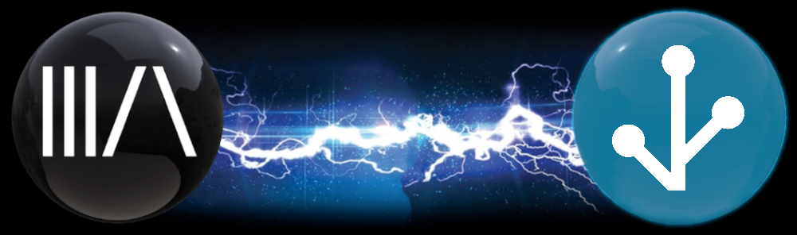

# Home Assistant Integration

{ align = center }

The Music Assistant HA Integration provides a connection between MA and HA. This means that MA players are visible in HA and can be controlled via the HA UI or via automations or scripts. 

HA media player entities, which are not natively available in MA, can be exposed to MA as well to allow playback on those devices.

Announcements are supported with the following features:
- If music is playing this will be temporarily paused and restored after the announcement
- Players will be powered on before the announcement and then off again if it was not powered/active before the announcement
- Volume will be increased slightly while playing the announcement
- If a player type has native support for announcements (e.g. Sonos) then that will be used in preference to the MA functionality providing an even smoother experience
- Works with all players that are supported by Music Assistant
- For TTS (Text to Speech) announcements, support is provided for prepending it with a "pre announcement sound". This sound can be enabled/disabled in the HA integration options

With some additional setup voice control of MA via HA is also possible.

Music Assistant was originally designed to solely work with HA and as a result this tight connection has been maintained and installing the integration will also install the server as an addon. This provides a minimal effort and most secure way of getting up and running. However, this is not the only way and if you have installed the MA server elsewhere (or as an addon before) you will be able to configure the integration to connect to it.

The Home Assistant integration consists of 2 parts:

1) The Home Assistant Plug-in provider. This plugin is currently an empty placeholder but will in the future contain some additional features such as allowing the linking of HA player controls (for example an amplifier volume control) to a MA player 

2) The Home Assistant Player Provider. This allows you to use your HA players within MA.
