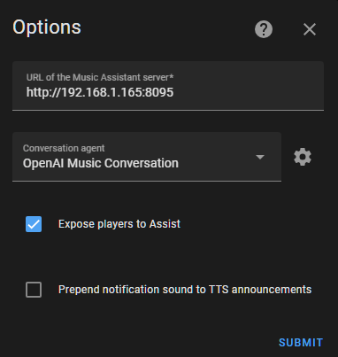

## Installation of the Home Assistant Integration

- Make sure that you have the [Home Assistant Community Store](https://hacs.xyz/) installed.
- Within HACS, search for `Music Assistant` and click the entry in the search results.
- Click the big (blue) button at the bottom for `Download`.
- Click the button again and in the dialog make sure `Show beta versions` is selected if you want to use those versions.
- Download the desired version
- Restart Home Assistant.
- Go to Configuration -> Integrations and click the big `+` button.
- Look for Music Assistant and click to add it.
- In the configuration if you do not intend to use the voice features then leave the Conversation Agent as None and you do not need to check the "expose players to Assist" checkbox. If you do intend to use voice it is slightly easier if you do the steps as part of the Installation Requirements first (see below). If you don't do them first then you will have to come back later and reconfigure the Conversation Agent.
- If Music Assistant does not show, refresh your browser (cache).
- The Music Assistant integration is ready for use.
- The MA server addon will be installed automatically.

!!! note
    You need to set-up the players and music sources within Music Assistant itself.

!!! note 
    The HA integration will create new media_player entities for those player types which are supported natively by MA. To see the names of those players go to `HA settings>>Devices & services>>Integrations>>Music Assistant` and view the entities. It is these players that need to be targeted in your automations.

## Service Calls

The integration adds two service calls for use in scripts and automations. 

- [mass.play_media](../faq/massplaymedia.md)
- [mass.search](../faq/masssearch.md)

## OpenAI features

During [Chapter 5 of "Year of the Voice"](https://www.youtube.com/live/djEkgoS5dDQ?si=pt8-qYH3PTpsnOq9&t=3699), [JLo](https://blog.jlpouffier.fr/chatgpt-powered-music-search-engine-on-a-local-voice-assistant/) showed something he had been working on to use the OpenAI integration along with Music Assistant. Note that this originally worked by using custom intents and it was difficult to reliably specify a player or an area for the music to be sent to. For this reason the functionality is built into the MA Integration.

**Installation Requirements**

- You need to be running the latest BETA of the HA Integration
- You need a voice assistant configured (even if you want to just type in the query)
- You need to create/add another OpenAI integration that is purely for Music Assistant.
Add the prompt found [here](https://github.com/music-assistant/hass-music-assistant/blob/main/prompt/prompt.txt) when completing the configuration. For the ChatGPT version `gpt-3.5-turbo-1106` has been found to work well.
- Add a directory to your Home Assistant `config` directory named `custom_sentences/en`
- Add the file found [here](https://github.com/music-assistant/hass-music-assistant/blob/main/custom_sentences/en/play_media_on_media_player.yaml), to that directory.
- When setting up the Music Assistant integration, make sure that you select the correct Conversation Agent and also allow the auto-exposure of MA media players to Assist



### Usage

!!! note
    This functionality has only been tested with `Home Assistant` selected as the `Conversation Agent` in the voice assistant configuration.

The command to play must follow a certain format. For the following examples assume the house has three areas called `Study`, `Kitchen `and `Karen's Bedroom` and there are three media players with friendly names "`Study Sonos`", "`Google Home`" and "`Karen's Speaker`". Assist aliases are supported for areas and entities.

There are two main formats which differ by where the playing location appears in the sentence. 
```
Play Nirvana in the Study
Listen to Nirvana in the Study
In the Study play Nirvana
In the Study listen to Nirvana
```
!!! note
You cannot ask to play to an area if there is more than one media player in that area.

You can do exactly the same as the above but use the friendly names or any assist aliases of the media player instead of the area name:

```
Play Nirvana on the Google Home
Play the Dixie Chicks First Album on Karen's Speaker
```

You can also use the words `speaker` or `player` or `media player` in conjunction with the area name:
```
Play Beds are burning by Midnight Oil on the Kitchen speaker
Play Journey Don’t stop believing on the Study media player
On Karen's Bedroom player listen to Journey Don’t Stop Believing
```

!!! note
    When adding a track it will be added to the top of the existing queue and played immediately. In all other cases the queue will be cleared and the requested music will then be added and playback will commence.
    
### Troubleshooting

- A response of "Sorry I couldn't understand that" indicates a failure in the pipeline before it reaches the HA integration. In this case consider doing the following.
    - Ensure media players and areas are exposed to Assist
    - Try typing the command
    - Look carefully for differences as the ASCII level for punctuation variation between devices. This ’ and this ' are different
    - Try adding an alias to the MA media player entity (which can be identical to the friendly name)
    - Add the following to your `configuration.yaml` so you can see more detail about the intent failure
```
    logger:
      default: warning
      logs:
        homeassistant.components.conversation: debug
        homeassistant.components.intent: debug
```

- If when trying to play to an area you receive “An unexpected error occurred while handling the intent” then:
    - Check the log for errors related to `No entities matched`. If found then make sure you don't have any entities named identically to your area
    - Ensure you aren't trying to play to an AREA and that area has multiple media players
