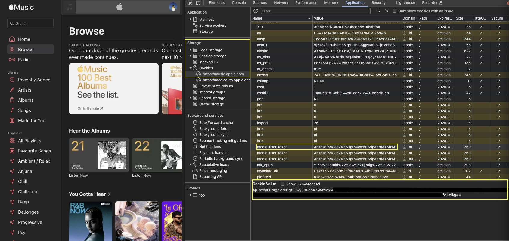

# Apple Music Provider { width=70 align=right }

Music Assistant has support for [Apple Music](https://music.apple.com/)! Contributed and maintained by [MarvinSchenkel](https://github.com/MarvinSchenkel)

!!! note
    This Music Provider is currently in beta (2.1+). Please report any issues [here](https://github.com/music-assistant/hass-music-assistant/issues).

## Features
- Support for Artists, Albums, Tracks and Playlists
- Searching the Apple Music catalogue
- Radio mode: Starting a dynamic playlist based on an Artist, Album, Track or Playlist

## Configuration
Authentication with Apple Music happens through a Music User Token. Unfortunately, Apple does not officially support 'Login with Apple' for Apple Music, so you will need to obtain your own Music User Token. Instructions were written for Chrome:

1. Navigate to [https://music.apple.com/](https://music.apple.com/)
2. Go to View > Developer > Developer Tools. A new side window will open.
3. Click the 'Application' tab. You might need to expand your window or click the `>>` button
  
4. Under Storage > Cookies, click "https://music.apple.com" and find the entry called "media-user-token"
5. Click it and copy the cookie value and use this in Music Assistant as the 'Music user token'
  

Note the "Expires / Max-Age" column. Your token will expire on that date and Apple Music within Music Assistant will stop working. You will have to repeat the above process to obtain a fresh token. We will try to find an unofficial way to implement 'Login with  Apple' to make it easier to authenticate with Apple Music, but until then, this is the way to authenticate.

## Known Issues / Notes
- Only the library functionality is officially supported by Apple. Playback unfortunately is not. This means that there are limitations to what Music Assistant can play from Apple Music. Currently, only high quality AAC can be played back. The AAC versions of songs are protected by Widevine DRM, which Music Assistant can currently decrypt. Lossless (ALAC) and Dolby Atmos are **not supported**, since they are protected by Apple's proprietary FairPlay DRM solution. This will remain the case until Apple decide to open up playback via their official API's.

## Not yet supported
- Library interaction, such as adding and removing items to your Apple Music library from within Music Assistant.
