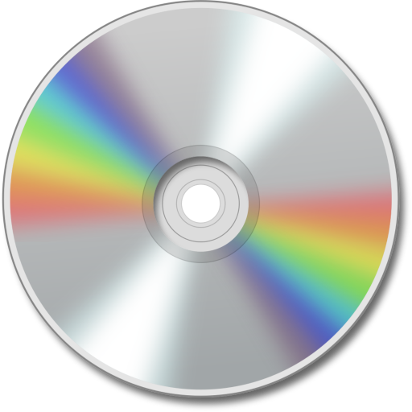

# Filesystem Provider { width=70 align=right }

Music Assistant has full support for reading your own (local) music files on disk or a remote server and catalogs it into the library, allowing playback to all player providers supported by Music Assistant. 

When streaming providers are also availabe in MA linking will only occur when the same item is found in the "Library" of that streaming provider. However, additional tracks and albums will be seen in various views or via the global search which can then be added to the MA Library

## Features

- Support for Artists, Albums, Tracks and Playlists.
- Local music is automatically included in the MA Library. 
- Files are not favourited by default. You can see all items if you deselect the "favourite" filter (the heart) and decide for yourself what you want in your favourites.
- If you also have any streaming providers connected, your media will be automatically linked and completed with info from the streaming provider(s).
- On playback, when tracks are linked across providers the highest quality version is used automatically.
- You can add multiple filesystem providers.

## Configuration

**Your files are on a disk/folder of the device running Music Assistant Server**

If your files are actually stored on the device running Music Assistant, for example the /media folder in Home Assistant OS, you should select the filesystem (local disk) option and enter the path to the files. 

!!! note
    For Home Assistant OS you can only access the /media folder. Docker users can mount their own folder paths. You can not mount a folder from Home Assistant into the /media path.

**Your files are on a remote share, such as a NAS or other (SMB/CIFS) server**

Music Assistant has support for SMB (also known as samba or CIFS) shares and DFS. Select the music provider "Filesystem (remote share)" and configure the (fqdn) hostname (or alternatively the IP address) to your server, the name of the share and optionally any subfolders.

## Known Issues / Notes

- If you are using the remote share connection, be aware that use of SMB1 (which is very old) is not receommended. If the connection keeps failing, look in your NAS settings to see if you can somehow disable SMB1.
- If you have local artwork then it is important that album FOLDER names exactly match the tagged album name except characters that are not allowed in folder names are not parsed. Therefore, "The Big Chill: Soundtrack" will match "The Big Chill Soundtrack" but "Vika and Linda" will not match "Vika & Linda"
- Artwork which is downloaded is throttled to approximately one request every 30 seconds so it will take some time to download all required artwork with large collections. You can force the download by selecting "Refresh Item" from the ⋮ menu in the banner at the top of a view.
- Embedded album thumbs will be extracted from audio files. However, you can save disk space by providing a single local artwork file vice embedding the same artwork in all files.
- Use the following naming convention for local artwork (png should also work). Artist thumb: artist.jpg; Album thumb: folder.jpg or cover.jpg; Fan Art (used as background in banners): fanart.jpg. Artist thumb and Fanart should be in the folder with the artist name. Album thumbs should be in the folder with the album name or in the disc folders below that. More about artwork file types can be found here https://kodi.wiki/view/Artwork_types
- Local tracks and albums will be linked to the same tracks or albums on other streaming providers. Note that same is not simply same name. The tags are reviewed to ascertain whether it is indeed the exact same track. Without tag information MA will attempt to identify identical tracks based on the other information it has such as artist name, album, and track length. However, poor tag information may lead to poor matches.
- MA prefers an Album Artist to be set for all albums. There is a setting under Advanced in the provider configuration for what to do if a track is found without this set. The default is to skip the track, so if your tracks are not being imported into the Library then check for this (there will be warnings in the log)
  
## Tagging Files 

- It is very important that all of your audio files contain proper ID3 tag information. The more comprehensive the tagging the better the results will be when using MA. For this reason it is strongly recommended that all files are tagged with [MusicBrainz Picard](https://picard.musicbrainz.org). This will ensure consistency and completeness of the tags that MA needs to work best. Other programs such as Mp3Tag are often also based on the Musicbrainz catalog and can work as well provided they include ISRC and all MBID tags.
- Music Assistant puts you in control by fully trusting the ID3 tags you provide, only additional information is scraped from metadata providers.
- Music Assistant has support for both embedded artwork and artwork stored in a common folder structure of Artist \ Album and .nfo files with enhanced metadata are also supported.
- Files simply dumped into a random structure will also be imported but no other data will be retrieved from the folder structure.
- To minimise the chance of problems with MA you should follow the Kodi guidelines here https://kodi.wiki/view/Music_tagging Just about all the tips, tricks and suggestions on that page are applicable to MA and if you follow it all to the letter you will have a much better experience.
- For multi disc albums it is recommended (but not required) to add folders named “Disc 1”, “Disc 2”, etc beneath a folder with the album name. Artwork for the album can be added to the top level album folder or in the disc folders.
- If there is nothing added to the disc tag then the disc number will not be shown in the display

