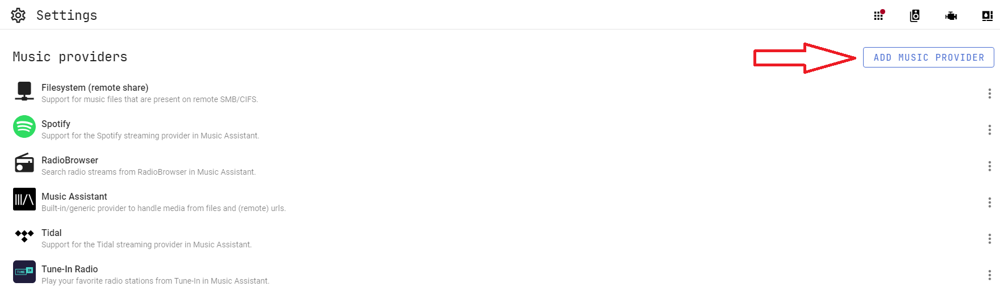

# Music Providers

For specific music provider information refer to the relevant section.

General Notes:

- You have to add providers in order to access your music even if the media is visible to HA.
- If you remove a provider a cleanup of the database will be done but it takes a little time to complete. If you restart MA or the provider before the cleanup completes the task will be terminated and will not restart.
- Music providers are added by navigating to MA Settings and then clicking on ADD MUSIC PROVIDER at the top of the page

{ width=400  }
