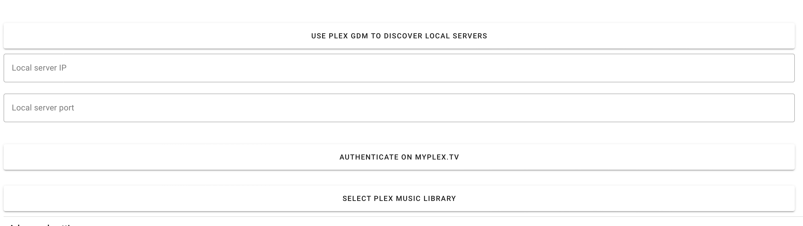

# Plex Provider { width=70 align=right }

Music Assistant has support for using Plex (MusicLibrary) as a Music Assistant provider contributed by @micha91

!!! warning Please be advised this provider is currently not maintained. Issues may take a long time to be resolved. Consider sharing your music directly with MA instead

## Configuration

- Click the `Use Plex GDM to discover local servers` button, this **should** discover your local server and prefill the `local_server_ip` and `local_server_port` fields.
- If GDM discovery fails, the 2 fields mentioned above will be filled with **"Discovery failed.... "**. In this case, please add the IP address of your server, and the port that you are exposing it on (usually 32400).
- Now click the `Authenticate on MYPLEX.TV` button, this may trigger your browser `pop-up` detection, so watch out for that, authenticate as you normally would for Plex.
- Select the Music library that you would like to use.
- Save the settings.

That should be all you need to do in order to get up and running with Plex.

## Notes

- A Plex provider is always bound to a user account and a library. 
  - If you have multiple libraries, you need to add the Plex provider multiple times.
  - If you have multiple Plex accounts, which have their own playlists, you can also add them as separate provider instances.
