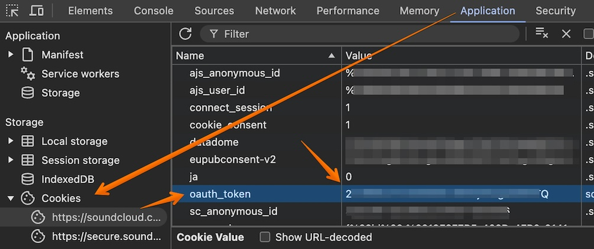

# SoundCloud Provider { width=70 align=right }

Music Assistant has support for Soundcloud. Contributed by [gieljnssns](https://github.com/gieljnssns)

## Configuration

Two fields need to be completed to use this provider, Client id and Authorization. To obtain these proceed as follows:

1. Delete your cookies for Soundcloud.
2. Go to [Soundcloud](https://soundcloud.com).
3. Open the `Inspect` tool (F12 on most browsers).
4. Go to the page `Network` on the inspect terminal.
5. Login.
6. Search for `auth`.
7. In one of the requests you will find the `client_id`
8. And for the OAuth token we need the `oauth_token` cookie on the soundcloud.com domain prepended with "OAuth "

`client_id`: string of 32 bytes alphanumeric
`oauth_token`: string inside the cookie value

### Client id
{ width=1005 align=center }

### OAuth token
{ width=1005 align=center }

Example snippet for the Music Provider configuration step (OAuth and client_id are NOT real, use yours):

```
client_id = jHvc9wa0Ejf092wj3f3920w3F920as02
Authorization = OAuth 3-26432-21446-asdif2309fj
```
## Known Issues / Notes

- Artists synced from Soundcloud are actually Soundcloud users.
- If a song by artist X is uploaded by user Y, this song belongs to the artist Y in Music Assistant
