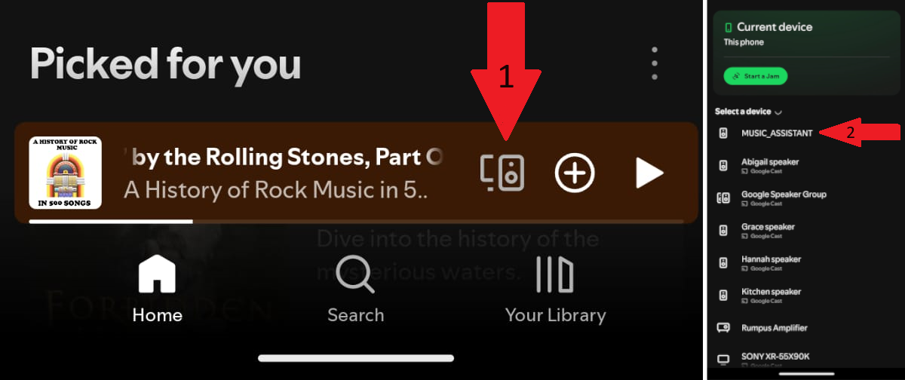

# Spotify Provider { width=70 align=right }

Music Assistant has full support for Spotify media listing and playback.

## Features

- Support for Artists, Albums, Tracks and Playlists.
- Items in your Spotify library (including the Liked Songs playlist) will be added to the Library in Music Assistant.
- Adding an item from Spotify to the Music Assistant Library will also add it to "Your Library" in Spotify
- Marking an item as a favourite in Music Assistant will also add it to the MA Library and "Your Library" in Spotify
- Multiple Spotify accounts can be added. All playlists from all accounts will be shown. If a playlist is selected for playback the source Spotify account will be used.
- Radio mode is supported

## Configuration
- In the configuration, you need to click on the large button AUTHENTICATE SPOTIFY
- A spinning circle will appear and will remain until you go to the Spotify App and click on the players icon and select MUSIC_ASSISTANT
  
  
  
- Once that is done the configuration page in MA will change and you can optionally alter the name of the provider or add a personal ClientID
- Entering a personal ClientID may speed up access to the Spotify API or eliminate rate limiting if that is encountered. How to obtain a ClientID is explained [here](https://developer.spotify.com/documentation/web-api/concepts/apps)

## Known Issues / Notes

- Only Spotify PREMIUM accounts are supported (includes Duo and Family), free accounts will not work.

## Not yet supported

- Podcasts support ([see this feature request](https://github.com/music-assistant/hass-music-assistant/discussions/429))
- Recommendations ([see this feature request](https://github.com/music-assistant/hass-music-assistant/discussions/535))
