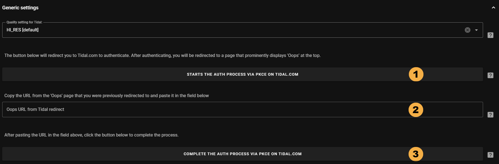

# Tidal Provider { width=70 align=right }

Music Assistant has support for [Tidal](https://tidal.com). Contributed and maintained by [jozefKruszynski](https://github.com/jozefKruszynski)

## Features

- Support for Artists, Albums, Tracks and Playlists
- Items in your Tidal library will be marked as "Favourites" in Music Assistant
- Marking an item as a "Favourite" from the Music Assistant interface will also mark it as favourite in Tidal
- On playback, the highest quality FLAC HiFi version will be selected
- Radio Mode is supported

## Configuration

In the configuration, there are a series of steps that must be completed in order. Start at the top of the page and work down. 

    { width=800 }

1. Click on the first button and you will be redirected to the Tidal login page and after logging in you will be taken to an error page which is normal.

    { width=800 }

2. Take the full URL in the address bar of the Oops error page and insert it into the configuration screen  

3. Click on the last button to complete the setup

## Known Issues / Notes

- If the authorisation process gets stuck then try a different browser. It is likely the authorisation pop up window is being blocked

## Not yet supported

- Recommendations ([see this feature request](https://github.com/music-assistant/hass-music-assistant/discussions/535))
- Multiple accounts (this is being worked on and available soon)
- Mixes
