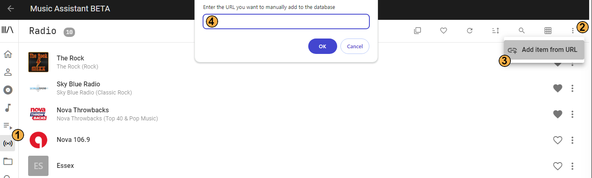

# URL Provider

Music Assistant has support for manually adding radio station URLs to the database.

## Features

- You can add any online station or your locally created stations using, for example, [Icecast](https://icecast.org/)

## Usage

The URL provider is enabled by default.

1. In the left hand menu you need to select 'Radio'
2. Then click on the ⋮ in the top right corner

3. Then click on ADD ITEM FROM URL
4. Add the full URL including http:// or https:// 

After completing step 4 the station will become available in the Radio view
