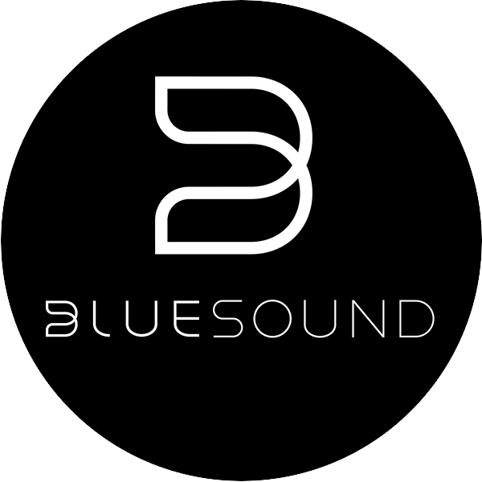

# Bluesound { width=70 align=right }

Music Assistant has support for [Bluesound](https://www.bluesound.com/) (BlueOS) based devices. This component is contributed and maintained by [Cyanogenbot](https://github.com/Cyanogenbot).

## Features

- Bluesound devices are auto detected in Music Assistant, plug and play
- Bluesound devices will play in sync

## Known Issues / Notes

- TBA
