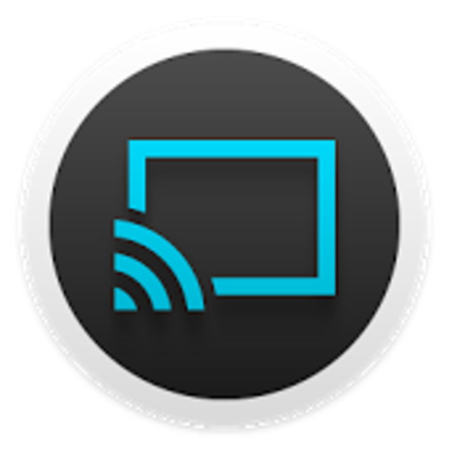

# Google Cast { width=70 align=right }

Music Assistant has full support for Google Cast based devices. This includes Google's own hardware like the Google Nest speakers but also a wide range of other brands have "Chromecast builtin" support, like Harman Kardon, JBL, Canton and many others. 

## Features

- Cast speakers are auto detected by Music Assistant
- Music Assistant supports playing to cast groups which are created in the Google Home app
- When using Google cast groups then perfect sync across players in that group is possible
- Any physical control buttons on the device should be supported as well as voice control

## Known Issues / Notes

- Cast speakers do not support crossfading of audio. If you want crossfade and/or full gapless support, enable the "[flow mode](../faq/normalization.md/#track-queueing)" in the player's advanced settings. Enabling flow mode may solve playback issues however it might come with the side effect of disabling actual physical buttons and/or display of metadata on the device itself
- If your Chromecast speakers are not auto detected or randomly unavailable then make sure that your Cast enabled speakers are on the same network/subnet as your Music Assistant server. Additionally, ensure that multicast traffic (more specifically mDNS) can travel freely as that is used for the discovery of players
- After re-enabling a disabled speaker, it can take a while before the speaker is rediscovered, the process can be sped up by restarting Music Assistant
- It is not possible to group/sync cast players from within the MA interface (simply because an api does not exist for that)
- TV/Video devices (not the AV dongles) are disabled by default
- Cast Groups containing only a stereo pair will not work
