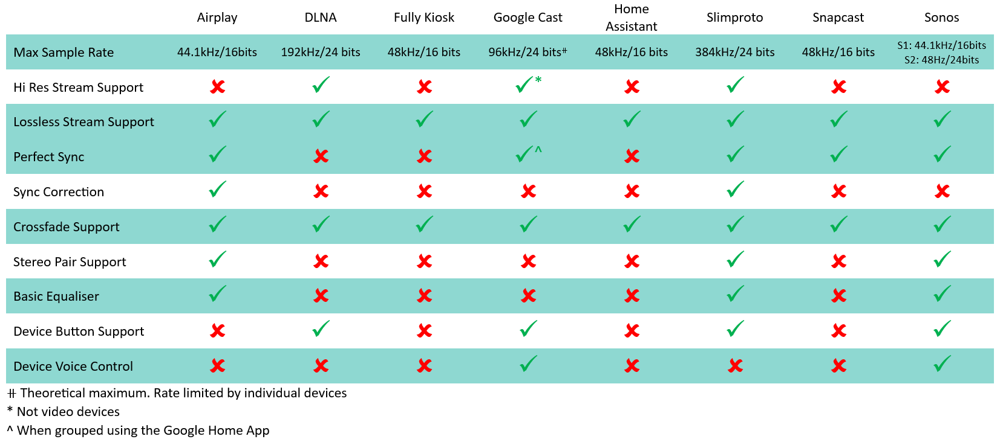
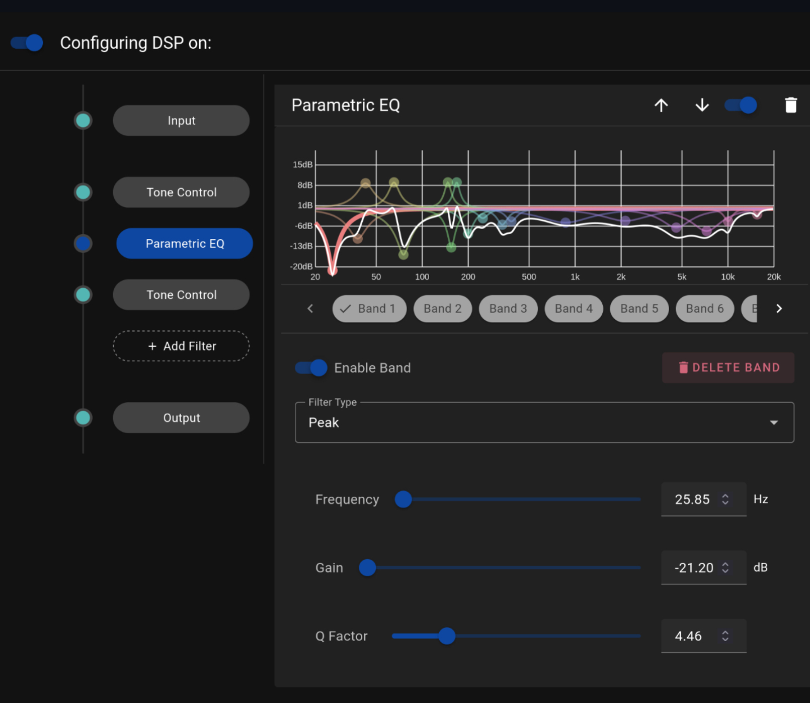

# Player Providers

For specific player provider information refer to the relevant section in this document. When a player provider is enabled then the devices which support that protocol will be automatically discovered by Music Assistant. The following table summarises player capabilities. Note that DLNA and HA players can suffer from poor implementation of required standards. If these player types do not work well and the device supports other protocols then use the other protocol.

{ width = 600 }

If a device supports multiple protocols then multiple players for the device will be seen. In the player provider settings you can disable or hide any players you do not use. 

Players can only be deleted if they are unavailable or disabled. Deleting a player can be useful if there is a problem with it. Deleted players which become or are still available will get rediscovered and will return to the list on MA restart or player provider reload.

{ width = 600 } 

!!! note
    If any player is not transitioning between songs then check if the player has the option QUEUE FLOW MODE. Try enabling it if it does.

## Audio Quality

Audio quality is the principal reason why native MA players are developed. These players provide the highest quality playback experience. HA players should work and may work well but they may also have been written with a basic objective such as enabling text to speech. Therefore, if there is a MA player available and a HA integration then you should always choose the MA player. 

A sample rate above 48kHz or a bit depth above 16 is considered High Resolution (Hi Res)

## DSP Settings

This functionality is available in MA 2.4.0 and later.

All providers have the option to apply [Digital Signal Processing](https://en.wikipedia.org/wiki/Digital_signal_processing) (DSP) filters to the audio stream. DSP lets you shape and refine the audio with a variety of filters. Use it to tailor the sound to a room's acoustics, compensate for speaker characteristics, and fine-tune the frequency balance to personal taste.

The DSP option is found in the MA settings for each player which means that each player has its own independently configurable DSP settings.

DSP settings will be disabled for all groups except AirPlay and Snapcast.

The DSP path consists of an INPUT pre-amplifier for initial gain control, followed by optional audio filters that can be added between input and output (multiple times if desired). The following filters are avialable:

- [Parametric Equalizer](../dsp/parametriceq.md)
- [Tone Controls](../dsp/tonecontrols.md)

The path ends with an OUTPUT stage that provides both gain control and a limiter (enabled by default) to prevent signal clipping.

The DSP settings can be enabled and disabled via a toggle which allows easy [A-B testing](https://www.youtube.com/watch?v=KefGjPYyIO4)

The line on the left of the DSP settings represents the audio path, in sequential order, from the audio file (top) to the player (bottom).

A dot on the line represents a component that changes the signal. The lack of a dot indicates that the particular component has been disabled.

Using the icons at the top of the view, the additional filters can be reordered, disabled/enabled or deleted.

