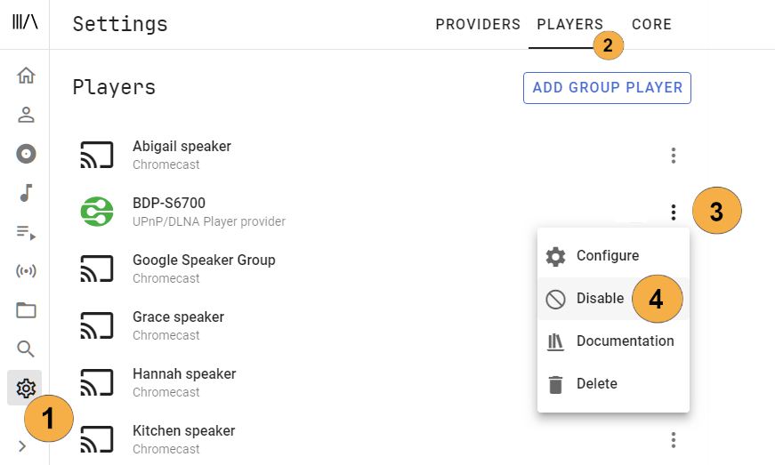

# Player Providers

For specific player provider information refer to the relevant section in this document. Most players are enabled by default and will be automatically discovered by Music Assistant.

In the player provider settimgs you can disable or hide any players you do not use.

 {width=600 } 

## Audio Quality

96kHz / 24 bits and above is considered High Resolution (Hi Res)

- Airplay support lossless (44.1kHz / 16 bits which is cd quality) but not Hi Res.
- Sonos supports lossless (44.1kHz / 16 bits which is cd quality) on series 1 models and 48KHz / 24 bits on series 2.
- Chromecast supports Hi Res up to 96KHz / 24 bits (except the video dongles which do 48KHz / 24 bits)
- Slimproto supports Hi Res up to 384kHz / 24 bits
- DLNA supports Hi Res up to 192kHz / 24 bits
- Snapcast supports up to 48kHz / 16 bits
