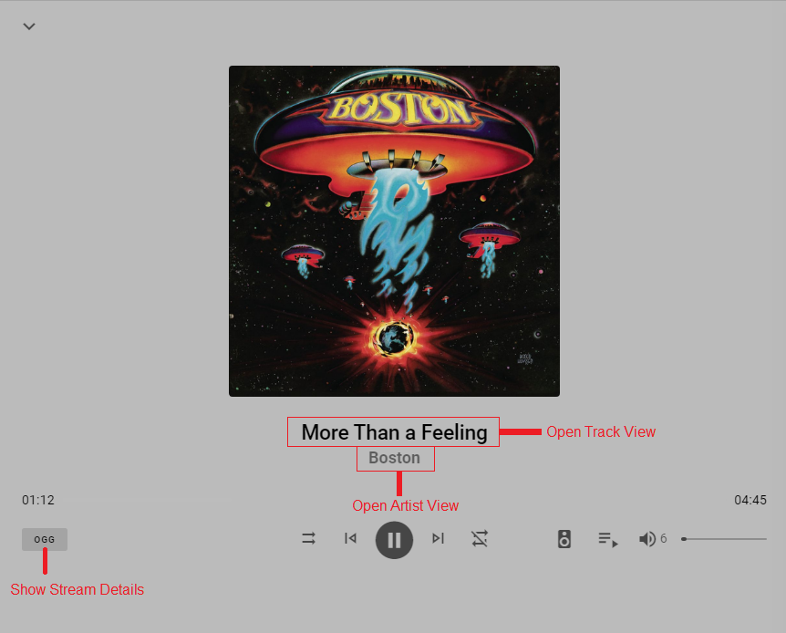

# User Interface

## Main Menu

This menu's appearance can be configured in the settings. It can be placed vertically (as shown) on the left or horizontally at the bottom. Any of the icons can be hidden. If the settings icon is hidden from this menu it is available in the top right of the HOME screen.

!!! warning
    If you remove both the Home and Settings icons then you will be locked out. In that case you will need to manually enter the path or clear the browser cookies to regain access to the settings page.

When visiting Browse you will only see what is already in the Library of the Streaming Providers. For the local Providers you will see all files and if a folder is visited that is not already in the MA Library it will be automatically added even if it has been previously removed.
***************************************************************

## Global Search

Searches can be done via any combinbination of words or partial words and also via a URL to a provider such as `https://open.spotify.com/album/0BwWUstDMUbgq2NYONRqlu` 

Results are returned in the six categories of Top Results, Tracks, Artists, Albums, Playlists and Radio. Context sensitive menus are available for the various items.
***************************************************************

## Player Bar

The codec shown in the UI to the right of the track title is the codec of the original source. MA re-encodes the track to FLAC when it is sent to the player (Unless the force lossy MP3 option is selected in the player settings (only available for some player types)). 
***************************************************************

## Now Playing View

This view will change depending on screen width. With wider displays you will be able to see the track that is playing (and associated information) as well as the queue. With narrow displays you need to use the toggle in the bottom right to switch between the currently playing information and the queue. Adjustments to the queue can be done with the ⋮ menu on the right.
***************************************************************

## Player List

!!! note
    The volume shown against a player group is the AVERAGE of the volumes of each individal player. When the group volume is changed then each player is changed by a proportionate amount.

When a player group is powered on the members of that group will disappear from the player list and individual playback to those players will not be possible. In order to playback to an individual player then either power off the group or remove the player from the group.

!!! note
    The MDI icon shown against each player can be changed in the player settings.
***************************************************************

## Grouping Players

If mutiple players in a group are being streamed to then this is shown by a number on the player name in the control bar. In the example image below there are two ACTIVE players in the group.

There are three ways to group players

1.    As shown in the previous section players can be linked via the icon in the player list. Only like player types that support synced playback are allowed to be joined. These players will then play in sync. It should be noted that when players are grouped in this way only the main player holds the queue. For example, player A has an existing queue and players B and C are joined to player A. If player A is turned off, players B and C will also stop.
2.    Create a group player via the settings. The native player types shown (i.e. not the Universal Group option) support perfect sync (this is a requirement to be shown here). In addition to playing in sync the group will also keep playing regardless of which player(s) in the group are powered off. So the group player holds the queue rather that any individual player. 

    

3.   Create a [Universal Group](player-support/universal.md)
***************************************************************

## Artist / Album / Track View

Album and Track Views look the same as the above except there is no album artist filter icon

A red dot on the search icon 
indicates that the viewed results are subject to filtering by search. This is useful if the search box has been closed.

A red dot on the refresh icon 
indicates that the viewed results have some sort of update pending. Press the refresh button.

Items in all views can be "right clicked" or "long pressed" to bring up an extensive menu of options which is the same as that accessed by the ⋮ menu on the right. In the image above the complete list of possibilities is shown and this will vary slightly depending on the current view.

Multiple selections of albums / artists / tracks is possible by clicking the multi-select icon. Once one or more items are selected then clicking on the "ACTIONS" at the bottom

will bring up this menu

The behaviour described above will work on any view where you see the "x item(s) selected" text.
***************************************************************

## Individual Artist View

The tracks and albums sections are collapsible. The view above shows them both collapsed. The tracks section shows ALL tracks that are in the library or that are available across all of the providers. A red dot on the library icon  indicates that the viewed results are filtered to only show items that are in the library. To see what albums any given track is on you can either sort alphabetically or click on one and use the context menu and SHOW INFO. 

The PROVIDER DETAILS section shows from where the albums and tracks listed above were obtained. It is normal to have multiple entries here if an artist has aliases or there are variant spellings, use of punctuation etc.  The ID shown against the streaming provider may be used in automations and scripts.
***************************************************************

## Track Menu

Right click or long press on a track to get the following

If the provider supports it you will also see the START RADIO option. This will populate the queue with tracks based on the selected track. The tracks are selected by the provider not MA. 

***************************************************************

## Track "Show Info" View

!!! note
    The PROVIDER DETAILS section in this view also has the functionality to play a short part of the track as a preview
