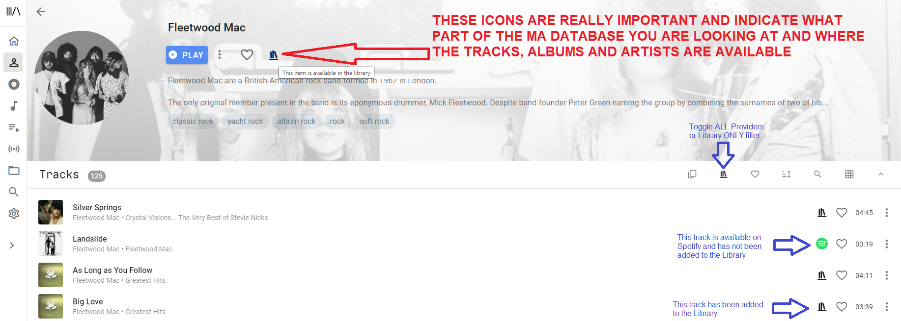
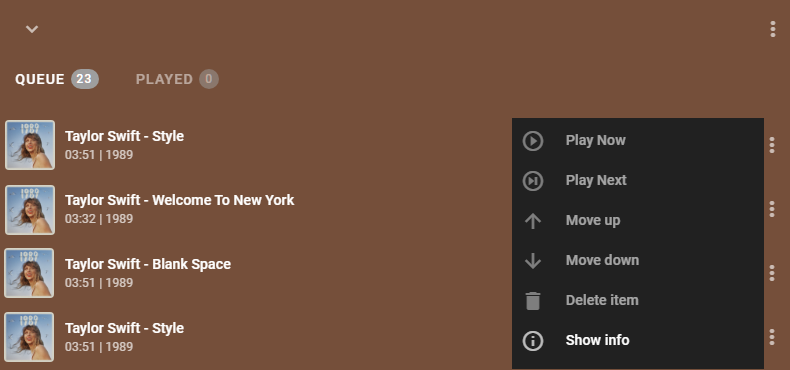
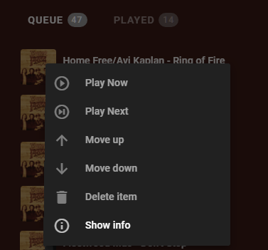
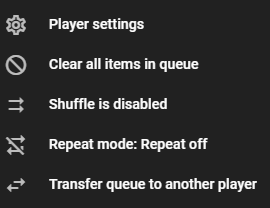

## The Library

The Music Assistant Library is a database containing details of the music which the user has indicated they are interested in listening to on a regular basis. It consists of information about Artists, Albums, Tracks, Playlists and Radio Stations which allows easy searching, display and cross referencing across the User Interface.

For local music providers all artists/albums/tracks/playlists are imported into the MA library when the provider is added and at each sync.

For streaming providers ONLY the SPECIFIC artists/albums/tracks/playlists that are in the streaming providers library (or favourites or however it is termed in the provider) will be imported into the MA library when the provider is added and at each sync. This means, for example, if you have an artist in the providers library but none of their albums then all you will see in the MA library is the artist with NO associated albums or tracks. You have to subsequently add albums or tracks to the MA library if you want to see them in the library views. Note you can toggle the library / streaming provider filter option to see all that is available in the streaming provider.

**Favourites**

As a further means of filtering the library, items can be marked as a "favourite". This is shown in the UI as a filled heart icon. Items are not favourited by default. You can see all items if you deselect the heart icon in the top menu.

## Players

For specific player provider information refer to the relevant section in this document. Most players are enabled by default and will be automatically diacovered by Music Assistant.

In the player provider settimgs you can disable or hide any players you do not use.

**Audio Quality**

96kHz / 24 bits and above is considered high resolution (Hi Res)

- Sonos annd Airplay support lossless (as in cd quality) but not Hi Res.
- Chromecast supports Hi Res up to 96KHz / 24 bits (except the video dongles)
- Slimproto supports Hi Res up to 384kHz / 24 bits
- DLNA supports Hi Res up to 192kHz / 24 bits
- Snapcast supports up to 48kHz / 16 bits

**Queue**

Each player has its own queue. Depending upon screen resolution the PLAYED ITEMS option may or may not be visible. If it is then selecting that will show the previous items from the queue and selecting any will restart the queue from that point.

Right clicking or long press on a track in the queue will show this menu

The options in the menu in the top right is shown below. This is the only place crossfade can be enabled or disabled (crossfade duration is set in the player settings). Repeat and Shuffle have buttons at the bottom.

## User Interface

See [here](ui.md)
